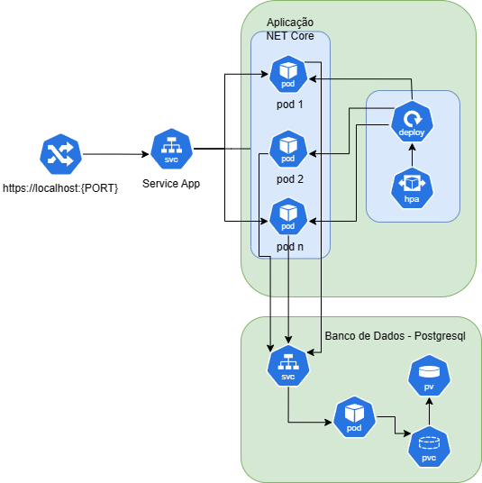

# fiap.tech-challenge.fast-food.api.orders

## Introdução
Projeto desenvolvido para a Pós-Graduação FIAP - Software Architecture.
O Tech Challenge Grupo 19 é composto por:
- Danilo Queiroz da Silva
- Elton Douglas Souza
- Leandro da Silva Câmara
- Marcelo Patricio da Silva


## Tecnologias
* [.NET 8.0](https://dotnet.microsoft.com/pt-br/download/dotnet/8.0)
* [ Entity Framework Core 8.0 ](https://devblogs.microsoft.com/dotnet/announcing-ef8/)
* [ OpenAPI - Swashbuckle ](https://learn.microsoft.com/pt-br/aspnet/core/tutorials/getting-started-with-swashbuckle)
* [ FluentMigrator ](https://fluentmigrator.github.io/)
* [ Postgresql ](https://www.postgresql.org/)


## Arquitetura
**Orders API** faz parte de uma solução composta por outras aplicações: [_Payments API_](https://github.com/leandrocamara/fiap.tech-challenge.fast-food.api.payments) e [_Tickets API_](https://github.com/leandrocamara/fiap.tech-challenge.fast-food.api.tickets).

Estas três aplicações são executadas no _AWS EKS_ e se comunicam via _HTTP_ e por mensagens via _AWS SQS_. 



A aplicação baseia-se na _Clean Architecture_. Para a camada _Entities_, foi adotado o _Domain Driven Design_.
Segue a estrutura da aplicação:

    .
    ├── Drivers                     # Frameworks & Drivers
        ├── API                     # Web API (.NET 8)
            ├── HealthChecks
            └── Routers
        └── External                # External Interfaces & DB
            ├── Clients
            └── Persistence
                ├── Migrations
                └── Repositories
    ├── Adapters                    # Interface Adapters
        ├── Controllers
        └── Gateways
    └── Core                        # Business Rules
        ├── Application
            └── UseCases
        └── Entities (Domain)
            ├── BoundedContext
                └── Model           # Aggregates - entities and value objects
            └── SeedWork            # Reusable classes/interfaces for the domain (by Martin Fowler)


## Execução

### AWS (Academy)

Após a execução dos [_Workflows_](https://github.com/leandrocamara/fiap.tech-challenge.fast-food.api.orders/actions) (_GitHub Actions_), a aplicação é implantada no **_Amazon EKS_** (_Elastic Kubernetes Service_) e se conecta ao **_Amazon RDS_** (_Relational Database Service_).

Pré-requisitos:
1. Executar o [_Workflow_](https://github.com/leandrocamara/fiap.tech-challenge.fast-food.infra.k8s) do repositório do **_EKS_**;
2. Executar o [_Workflow_](https://github.com/leandrocamara/fiap.tech-challenge.fast-food.infra.database) do repositório do **_RDS_**.

Há duas maneiras de executar e implantar a aplicação na _AWS_:

1. Realizando um `push` na `main`, por meio de um `Merge Pull Request`;

2. Executando o [_Manual Deployment_](https://github.com/leandrocamara/fiap.tech-challenge.fast-food.api.orders/actions/workflows/manual-deployment.yaml) (_Workflow_)

    

    2.1. Por padrão, o _Workflow_ utilizará as `Secrets` configuradas no projeto. Caso esteja utilizando o `AWS Academy`, recomenda-se informar as credencias da conta. **Obs.:** Cada sessão do _AWS Academy_ dura **4 horas**.

Para acessar o _Swagger_ da aplicação, é possível obter a URL no **Console da AWS**. Acesse: _`EKS > Clusters > EKS-fast-food > Service > Load balancer URLs`_

**Obs.:** Utilize o `http://<load-balancer-url>/swagger` (**ao invés de** `https`).


### CLI

O projeto pode ser executado utilizando o Docker.
Para iniciar a aplicação e banco de dados separadamente, siga os passos abaixo.

Para subir o BD local, o recomendado é utilizar o Docker e executar o seguinte comando:
```shell
docker run --rm --name pg-orders-docker -e POSTGRES_PASSWORD=docker -e POSTGRES_DB=orders_db -d -p 5432:5432 postgres
```

Obs.: A *connection string* do BD local já está configurada corretamente no arquivo *launchSettings.json*. Contudo, espera-se que as credenciais da AWS sejam incluídas no arquivo, para o funcionamento com o AWS SQS.

Inicie a Aplicação (API):
```shell
dotnet run --project .\src\Drivers\API\API.csproj
```

Swagger UI da API: `http://localhost:5000/swagger` (***Recomendado para testar as chamadas aos endpoints***)

Caso seja necessário derrubar o BD local, basta executar:

```shell
docker container kill pg-orders-docker
```


## Como testar

Para o correto funcionamento deste serviço, os demais serviços também precisam estar em execução ([_Payments API_](https://github.com/leandrocamara/fiap.tech-challenge.fast-food.api.payments) e [_Tickets API_](https://github.com/leandrocamara/fiap.tech-challenge.fast-food.api.tickets)).


### Fluxo de teste

Para testar a aplicação, recomendamos a seguinte ordem:
1. _Orders API_ - Incluir um produto.
2. _Orders API_ - Incluir um novo cliente.
3. _Orders API_ - Buscar a lista de produtos por categoria.
4. _Orders API_ - Criar um novo pedido (podendo ou não informar o ID do cliente).
5. _Payments API_ - Atualizar o status do pagamento.
6. _Tickets API_ - Atualizar o status da comanda ("Em preparação" e "Pronto").
7. _Orders API_ - Listar todos os pedidos em andamento.
8. _Orders API_ - Atualizar o status do pedido para "Finalizado".

Todo o fluxo está presente na [**_Collection do Postman_**](./docs/postman/FIAP.FastFood.postman_collection.json).


### Schema de Banco de dados
A aplicação conta com uma biblioteca de _migrations_ configurada, portanto, ao iniciar a aplicação, o banco de dados será atualizado com as tabelas e dados necessários.


### Endpoints
O detalhe de cada _request_, como seus parâmetros e tipos estão detalhadas nas interfaces de UI do _Swagger_. Nas próximas sessões estão resumidas as operações existentes.


### Produtos
O sistema já possui uma carga de produtos pré cadastrados para serem utilizados nos testes, você pode acessar a lista de produtos por categoria através do método:
`[GET] api/products?category={categoryId}`.

Também é possível criar produtos ou editar, excluir e recuperar produtos pelo seu **ID**. Os endpoints são os seguintes:
- `[GET] api/products/{id}`: Deve ser fornecido o id do produto a ser retornado.
- `[POST] api/products`: Criar um novo produto.
- `[PUT] api/products`: Atualizar um produto existente da base de dados.
- `[DELETE] api/products/{id}`: Excluir um produto existente da base de dados.

#### Códigos das Categorias de Produtos
- `0`: Lanches
- `1`: Acompanhamentos
- `2`: Bebidas
- `3`: Sobremesas


### Clientes
O sistema dispõe de endpoints para cadastrar clientes para relacioná-los aos pedidos, embora não seja requerido para criação de um pedido.
Não há carga prévia de dados para clientes.

Há dois endpoints para manipulação do cadastro de clientes:
- `[POST] api/customers`: Criar um novo cliente caso o CPF já não se encontre na base de dados.
- `[GET] api/customers?cpf={cpf}`: Retornar um cliente por seu CPF.


### Pedidos
É possível criar um pedido, retornar a lista de pedidos existentes e retornar os detalhes de um pedido por seu **ID**.
- `[POST] api/orders`: Criar um novo pedido com o status Pay com os itens e relacionado ao cliente (quando informado).
- `[GET] api/orders/ongoing`: Retorna a lista dos pedidos em andamento, ordenada dos mais antigos para os mais novos.
- `[POST] api/orders/{id}/status/{status}`: Atualiza o status de um pedido específico.
- `[GET] api/orders/{id}`: Retorna o detalhe de um pedido informado pelo **{id}**.

#### Status dos Pedidos
- `0`: Pagamento Pendente
- `1`: Pagamento Recusado
- `2`: Pedido Recebido na Cozinha
- `3`: Cozinha Preparando Pedido
- `4`: Pedido Pronto
- `5`: Pedido Concluído


## Vídeos de apresentação
Alguns vídeos que explicam como implantar a aplicação, uso das APIS e escolhas de design estão em uma [playlist do youtube](https://youtube.com/playlist?list=PLuVYnmmdbgO1ams1lmM4tDwmZxym5vV7w&si=ve6Ck3-chgUc_JFZ).
